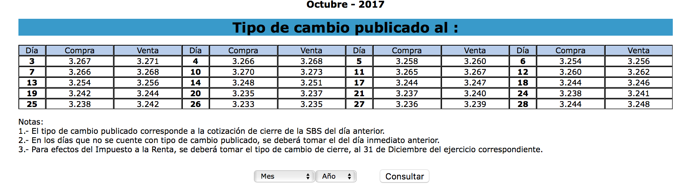

```{r setup, include=FALSE}
knitr::opts_chunk$set(echo = TRUE)
```

## A simple Scraper extrancing currency exchange data from SUNAT

Here I will demostrate a simple web scraping example using a table of exchange rates from Peru's tax agency SUNAT. Today that page looked like this:





### First we load the `rvest` library and the webpage we want to scrape using its url.
```{r}
  library(rvest)
  url <- 'http://www.sunat.gob.pe/cl-at-ittipcam/tcS01Alias'
  webpage <- read_html(url)
  
```


### We get the webpage tables with `html_nodes` 
```{r}
  
  tbls <- html_nodes(webpage, "table")
  length(tbls)
  
  
```
the are 6 tables. But through trial and error I find that my table of interest is table 2.


```{r}
  tbl2<-html_table(tbls[[2]])
  print(tbl2)
  dim(tbl2)
  num.cols<-dim(tbl2)[2]
  num.rows<-dim(tbl2)[1]
  num.cols
  num.rows
  
```

## Reformatting the data into a  tidy data.frame

We already have the number of rows and columns and we used them to create vectors that we then integrate into a data.frame

```{r}
  dia<-c()
  compra<-c()
  venta<-c()
  num.cols
  num.rows
  for(i in 2:num.rows){
     for(j in 1:(num.cols/3)){
     
        dia<-c(dia,as.numeric(tbl2[i,(j-1)*3+1]))
        compra<-c(compra,as.numeric(tbl2[i,(j-1)*3+2]))
        venta<-c(venta,as.numeric(tbl2[i,(j-1)*3+3]))
     }
  }
  
  output<-data.frame(dia,compra,venta)
  print(output)
  
```